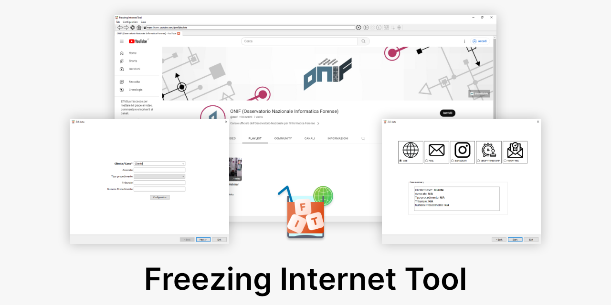

# Freezing Internet Tool
`FIT` is a Python3 application for forensic acquisition of contents like web pages, emails, social media, etc. directly from the internet. 
It's based on Fabio Zito **@zitelog** [final exam](https://github.com/zitelog/fit) for a Master named in Cybersecurity, Digital Forensics and Data Protection where the relator was Prof. Giovanni Bassetti **@nannib**.

For the implementation: 
* MVC Pattern
* Python Language
* [Qt](https://www.qt.io/download-open-source) as graphical user interface and Web Engine 
* Scapy for packet capture
* [Qt Multimedia](https://doc.qt.io/qt-6/qtmultimedia-index.html) for screen video and audio recording. For more information about audio recording, refer to the [guide](https://github.com/fit-project/fit/wiki/Screen-recording-audio-management)
* SQLite and SQLAlchemy for persistence

## Suggestions
On PCs with Windows OS it is strongly recommended to install [NPCAP](https://npcap.com/dist/) otherwise it will not be possible to capture the network traffic and to excute traceroute. Do not install WinPCAP because they have been deprecated.

## Downloading Portable Version
If you want download FIT portable version click [here](https://github.com/fit-project/fit/releases/latest) (for the moment just for windows ).

## Cloning the github repository
```
git clone git@github.com:fit-project/fit.git fit
```

This will clone the latest version of the FIT repository to a **fit** folder.


## Install
Once you've downloaded FIT and installed all the prerequisites:

* go in fit folder:
```
cd fit
```
* If you don't have [poetry](https://python-poetry.org/), install it (below its showed windows Powershell):
```
(Invoke-WebRequest -Uri https://install.python-poetry.org -UseBasicParsing).Content | python -
```
* install the dependencies:
```
poetry install
```
## Running FIT

Run your application:

```
poetry run python fit.py
```
